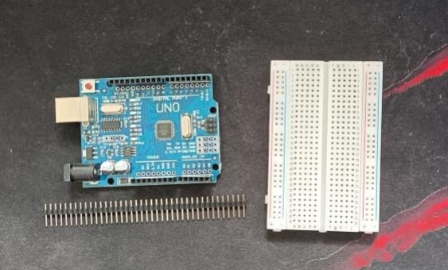
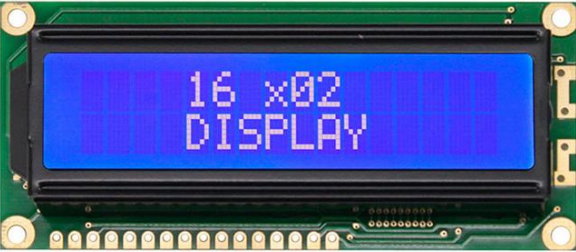
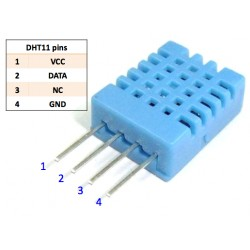
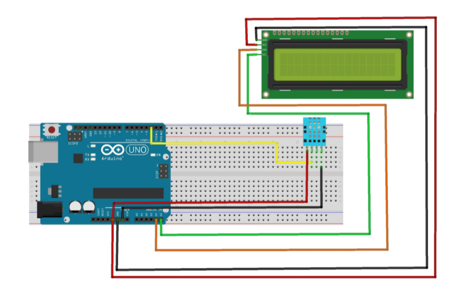

# EiTprojekt
mój projekt

Do zbudowania układu który będzie mierzył wilgotność oraz temperaturę potrzebne jest parę 
elementów, oczywiście potrzebujemy podstawowego kitu arduino w moim przypadku będzie to [1]. 
Następnym niezbędnym elementem jest oczywiście sam czujnik temperatury / wilgotności 
zdecydowałem się na czujnik DHT11 [2]. Dodatkowo by wyświetlić mierzone parametry musimy mieć 
wyświetlacz LCD 16x2 [3]. Czwarty element to potencjometr [4] którego wartości jeszcze nie 
dobrałem (ale coś pewnie koło 10/20k). Ostatnim elementem jest płytka prototypowa gdzie cały 
układ zostanie połączony [5]. 



JPG przedstawia moją płytkę podstawową oraz prototypową

Arduino uno R3 datasheet:
http://www.linhkientot.vn/ebook/arduino-uno-r3-datasheet.pdf

[2] wyświetlacz LCD 16x2



Wyświetlacz datasheet: jest na tej stronie 
https://www.winstar.com.tw/products/character-lcd-display-module/16x2-datasheet.html

[3] DHT11 czyli czujnik do pomiaru temperatury i wilgotności:



Czujnik datasheet:
https://www.mouser.com/datasheet/2/758/DHT11-Technical-Data-Sheet-Translated-Version-1143054.pdf

Schemat układu: niezbędne połączenia 




Biblioteki z których kożystam
```cp 
#include <SimpleDHT.h>
#include <Wire.h> 
#include <LiquidCrystal_I2C.h>
```

W tym kroku deklaruję czyjnik oraz informuję o pinie, na którym odbywać ma się komunikacja
```cp 
int pinDHT11 = 2;
SimpleDHT11 dht11(pinDHT11);
LiquidCrystal_I2C lcd(0x27, 16, 2);
``` 


W pierwszej linii setupu definiujemy 16 kolumn i 2 rzędy wyświetlacza lcd, następnie włączamy tylne swiatło wyświetlacza.

```cp 
void setup()
{
  lcd.begin(16,2);
  lcd.backlight();
}
```

W pętli deklaruje zmienne pod nazwą stopie oraz wilgoc i przypisuje im dane pobrane z czujnika DHT11

```cp
void loop() {
  // read without samples.
  byte stopnie = 0; //deklaruje wartość zmienną o naziwie stopnie
  byte wilgoc = 0;  //deklaruje wartość zmienną o naziwie wilgoc
    int err = SimpleDHTErrSuccess;
  if ((err = dht11.read(&stopnie, &wilgoc, NULL)) != SimpleDHTErrSuccess) {
    lcd.print("error");
    delay(1000);
    return;
  }
  ```
  Ostatnia część kodu zajmuje sie wyświetlaniem.
  lcd.setCursor(0, 0); oznacza ustawienie kursora na 0 rząd i 0 kolumnę wyświetlacza,
  następnie wyświetlamy potrzebny tekst oraz zmienną pobraną z czujnika.
  lcd.setCursor(0, 1); oznacza ustawienie kursora na 0 rząd i 1 kolumnę wyświetlacza,
  następnie wyświetlamy potrzebny tekst oraz zmienną pobraną z czujnika.
  delay(1000); Delay ustawiamy na 1000 ms ponieważ częstotliwość próbkowania wynosi 1Hz.

```cp
  lcd.setCursor(0, 0);
  lcd.print("Temperatura  "); //wyświetla na lcd tempertaura 
  lcd.print((int)stopnie);   //wyświetl stopnie 
  lcd.print("C ");
  lcd.setCursor(0, 1);
  lcd.print("Wilgotnosc   ");
  lcd.print((int)wilgoc);
  lcd.print("% ");
  delay(1000);
```

Całość kodu prezentuje sie następująco
```cp
#include <SimpleDHT.h>
#include <Wire.h> 
#include <LiquidCrystal_I2C.h>

// for DHT11, 

int pinDHT11 = 2;
SimpleDHT11 dht11(pinDHT11);
LiquidCrystal_I2C lcd(0x27, 16, 2);

void setup() {
  lcd.begin();
  lcd.backlight();
}


void loop() {
  // read without samples.
  byte stopnie = 0; //deklaruje wartość zmienną o naziwie stopnie
  byte wilgoc = 0;  //deklaruje wartość zmienną o naziwie wilgoc
    int err = SimpleDHTErrSuccess;
  if ((err = dht11.read(&stopnie, &wilgoc, NULL)) != SimpleDHTErrSuccess) {
    lcd.print("error");
    delay(1000);
    return;
  }
   
  lcd.setCursor(0, 0);
  lcd.print("Temperatura  "); //wyświetla na lcd tempertaura 
  lcd.print((int)stopnie);   //wyświetl stopnie 
  lcd.print("C ");
  lcd.setCursor(0, 1);
  lcd.print("Wilgotnosc   ");
  lcd.print((int)wilgoc);
  lcd.print("% ");
  delay(1000);
}
```

Dodam jeszcze pare fotek jak prezentuje sie zbudowany układ 

![układ fotki] (układ1.jpg)


